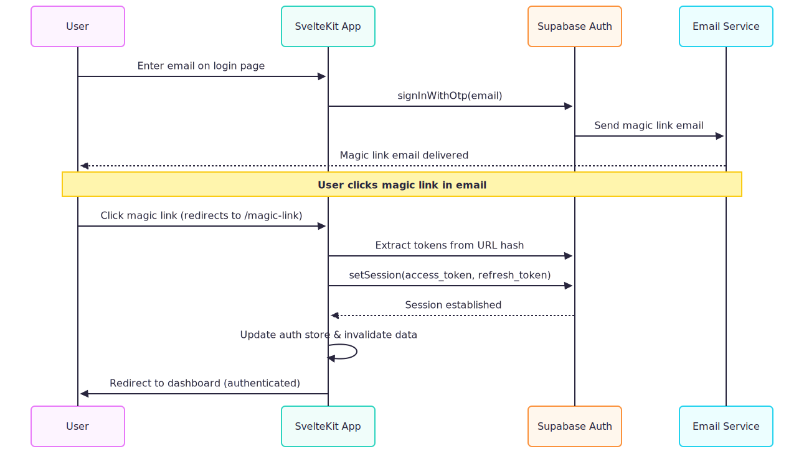

# HelloWorld JWT - SvelteKit with Supabase Passwordless Authentication

This is a Server-Side Rendered (SSR) HelloWorld application built with SvelteKit and Supabase Authentication featuring a modern passwordless magic link system.

## Features

- **🔐 Passwordless Authentication**: Magic link authentication via email (no passwords required)
- **🎨 Modern Design System**: Centralized CSS with custom design tokens and components
- **⚡ SSR Authentication**: Server-side rendering with secure Supabase authentication
- **🚀 Magic Link Flow**: Seamless authentication with email-based magic links
- **📧 Professional Email Templates**: Branded HTML email templates for authentication
- **🛡️ Security First**: Secure session management with proper JWT handling
- **📱 Responsive Design**: Clean, modern UI that works on all devices
- **🔄 Real-time Auth State**: Synchronized authentication state across the application

## Setup Instructions

### 1. Create a Supabase Project

1. Go to [Supabase](https://supabase.com) and create a new project
2. Wait for the project to be fully initialized
3. Go to Settings → API to find your project URL and anon key

### 2. Configure Environment Variables

1. Copy the `.env.example` file to `.env`:
   ```bash
   cp .env.example .env
   ```

2. Update the `.env` file with your Supabase credentials:
   ```
   PUBLIC_SUPABASE_URL=https://your-project-id.supabase.co
   PUBLIC_SUPABASE_ANON_KEY=your-anon-key-here
   ```

### 3. Configure Supabase Authentication

1. In your Supabase project, go to **Authentication → Settings**
2. Configure your **Site URL** (e.g., `http://localhost:5173` for development)
3. Add redirect URLs for magic links:
   - `http://localhost:5173/magic-link` (development)
   - `https://yourdomain.com/magic-link` (production)

### 4. Upload Email Templates (Optional)

1. Go to **Authentication → Email Templates** in your Supabase dashboard
2. Upload the branded templates from `templates/email/`:
   - **Magic Link**: Use `magic-link-body-only.html`
   - **Confirm signup**: Use `confirm-signup.html`

### 3. Install Dependencies

```bash
npm install
```

### 4. Run the Application

```bash
npm run dev
```

Visit `http://localhost:5173` to see the application.

## Authentication Flow

### Passwordless Magic Link Authentication



### Authentication States

1. **🔄 Loading**: Initial state while checking authentication
2. **✅ Authenticated**: User is logged in via magic link, shows personalized content
3. **❌ Unauthenticated**: User needs to request a magic link
4. **📧 Magic Link Sent**: User has requested a magic link and should check email
5. **🔗 Magic Link Processing**: User clicked magic link, validating and setting session

### File Structure

```
src/
├── lib/
│   ├── stores/
│   │   └── auth.ts          # Authentication store with real-time state
│   ├── database.types.ts    # Supabase database types
│   ├── supabase.ts         # Supabase client configuration
│   └── api-client.ts       # API client for backend integration
├── routes/
│   ├── login/
│   │   ├── +page.svelte    # Passwordless login page (magic link)
│   │   └── +page.server.ts # Server-side login actions
│   ├── magic-link/
│   │   └── +page.svelte    # Magic link validation page
│   ├── logout/
│   │   └── +server.ts      # Logout handler
│   ├── +layout.svelte      # Main layout with navigation
│   ├── +layout.server.ts   # Server-side layout loader
│   ├── +layout.ts          # Client-side layout loader
│   └── +page.svelte        # Home page with HelloWorld message
├── app.d.ts                # TypeScript declarations
├── hooks.server.ts         # Server-side hooks for secure auth
└── app.css                 # Centralized design system
templates/
└── email/
    ├── magic-link-body-only.html  # Magic link email template
    ├── confirm-signup.html         # Signup confirmation template
    └── README.md                   # Email template documentation
```

### Key Components

- **🏠 Home Page**: Shows HelloWorld message for authenticated users, login prompt for guests
- **🔐 Login Page**: Email-only form for passwordless authentication
- **🔗 Magic Link Page**: Handles magic link validation and session setup
- **📧 Email Templates**: Professional branded email templates for authentication
- **🎨 Design System**: Centralized CSS with custom properties and component classes

## Pages & Routes

- **Home (`/`)**: Shows HelloWorld message for authenticated users, or login prompt for guests
- **Login (`/login`)**: Passwordless authentication with magic link via email
- **Magic Link (`/magic-link`)**: Validates magic link tokens and establishes session
- **Logout**: Server action to sign out users and clear session

## Design System

The application features a comprehensive design system with:

- **🎨 CSS Custom Properties**: Centralized color palette and spacing system
- **📱 Responsive Components**: Mobile-first design with flexible layouts
- **🔧 Utility Classes**: Consistent spacing, typography, and layout utilities
- **🎯 Component Classes**: Reusable button, card, and form components
- **✨ Modern Styling**: Gradients, shadows, and smooth transitions

## Backend Integration

The application integrates with a Rust backend API:

- **🔐 JWT Token Validation**: Secure API authentication using Supabase JWT tokens
- **🚀 API Client**: Configured HTTP client for backend communication
- **📊 Status Monitoring**: Real-time API connection status on dashboard
- **⚡ Performance**: Optimized API calls with proper error handling

## Email Templates

Professional branded email templates include:

- **🪄 Magic Link Email**: Passwordless authentication with branded design
- **✅ Signup Confirmation**: Welcome email with account confirmation
- **📧 Inline CSS**: Maximum compatibility across email clients
- **🎨 Responsive Design**: Works on desktop and mobile email clients

## Supabase Configuration

The application uses Supabase's passwordless authentication features:

- **🔐 Magic Link Authentication**: Email-based OTP authentication
- **🛡️ JWT Tokens**: Secure session management with automatic token refresh
- **🔄 Server-Side Rendering**: Full SSR support with cookie-based sessions
- **📧 Email Templates**: Custom branded email templates for authentication
- **🔒 Row Level Security**: Secure data access patterns

## Security Features

- **✅ Secure Session Handling**: Uses `getUser()` for validation, `getSession()` for tokens only
- **🔐 Magic Link Validation**: Secure token extraction and session establishment
- **🛡️ CSRF Protection**: Built-in protection against cross-site request forgery
- **⏰ Token Expiration**: Automatic token refresh and expiration handling
- **🔒 HTTP-Only Cookies**: Secure session storage in HTTP-only cookies

## Development

To add new features:

1. Update the database types in `src/lib/database.types.ts`
2. Modify the authentication store in `src/lib/stores/auth.ts`
3. Add new routes in the `src/routes/` directory
4. Update the design system in `src/app.css`
5. Test email templates in `templates/email/`

## Production Deployment

1. Set up your production Supabase project
2. Configure authentication redirect URLs for your domain
3. Upload custom email templates to Supabase
4. Update environment variables for production
5. Deploy to your preferred hosting platform (Vercel, Netlify, etc.)
6. Configure your domain in Supabase authentication settings

## Architecture Notes

- **🔄 Passwordless System**: No password storage or management required
- **📧 Email-Based Auth**: Secure magic link authentication via email
- **🎨 Design System**: Centralized CSS with reusable components
- **🛡️ Security First**: Proper JWT handling and session management
- **⚡ Performance**: Optimized SSR with client-side hydration
- **📱 Responsive**: Mobile-first design with flexible layouts

```bash
npm run dev

# or start the server and open the app in a new browser tab
npm run dev -- --open
```

## Building

To create a production version of your app:

```bash
npm run build
```

You can preview the production build with `npm run preview`.

> To deploy your app, you may need to install an [adapter](https://svelte.dev/docs/kit/adapters) for your target environment.
